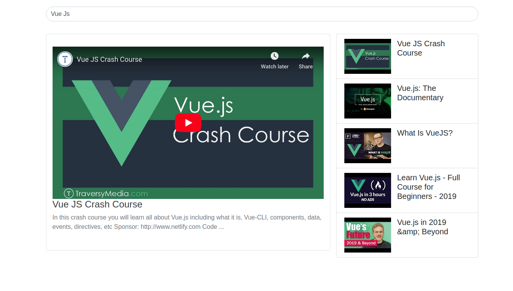

### Screenshot

### Setup the project

>1. Create enviorment files .env and .env.prod into root directory
>2. Add below code into both of the files
>3. `VUE_APP_API_KEY = insert your youtube api key here`
>4. Install packages
>5. `npm install`
